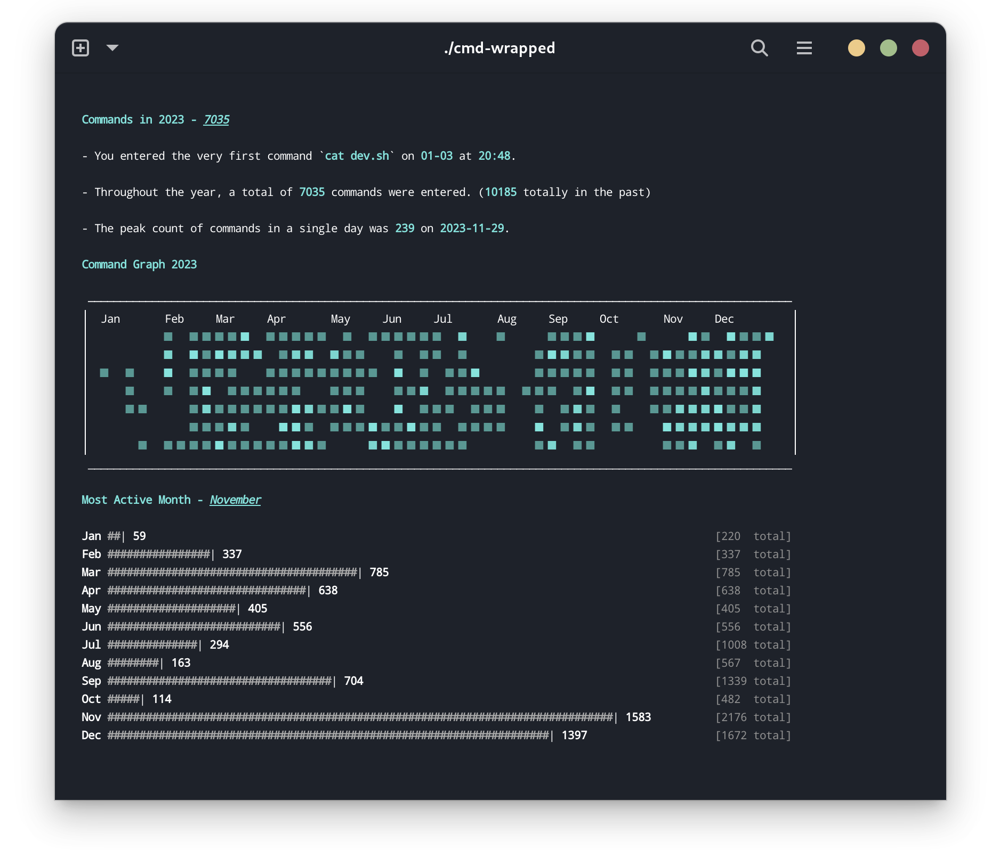
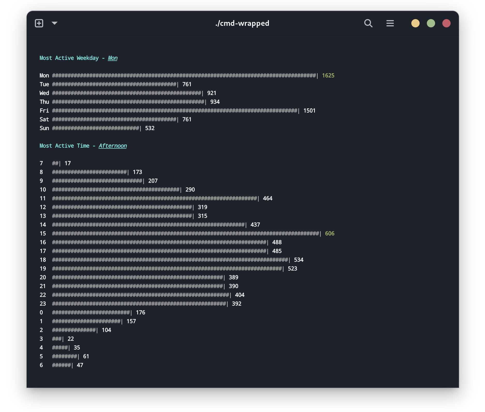
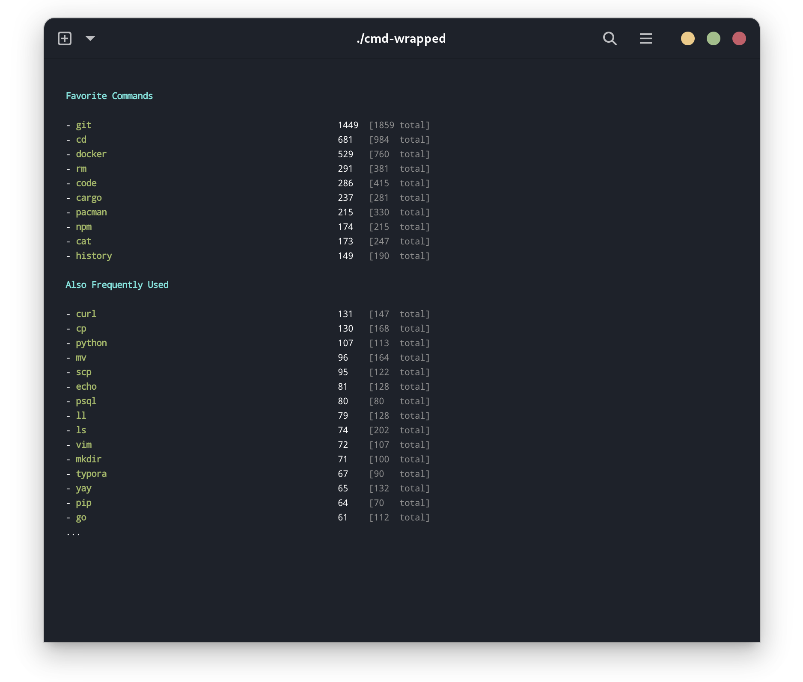

<p align="right">
    <a href="./README.md">
	English  
	</a>
     / 简体中文
</p>

# cmd-wrapped

在命令行中查看你的过去一年！





## Features

- 支持 Zsh & Bash
- 可通过参数显示过去任意一年的数据

## 如何运行

1. 从源码构建 (推荐，但需要安装 `cargo`)

   ```shell
   git clone git@github.com:YiNNx/cmd-wrapped.git
   cd cmd-wrapped
   # 查看过去一年
   cargo run
   # 查看指定年份
   cargo run -- 2022
   ```

2. 从 [Release](https://github.com/YiNNx/cmd-wrapped/releases/latest)中下载对应包并解压，在命令行中运行:

   ```shell
   # 查看过去一年
   ./cmd-wrapped
   # 查看指定年份
   ./cmd-wrapped 2022
   ```

## 致谢 & 开源协议

- 感谢 [@jyi2ya](https://github.com/jyi2ya) 的绝妙点子 :kissing_heart:
- 开源协议: [MIT](https://github.com/YiNNx/cmd-wrapped/blob/master/License)